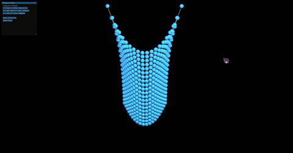

# 实验：质点弹簧布料物理模拟（多积分器对比 Taichi）
本项目基于 Taichi GPU 并行框架实现布料质点弹簧物理仿真，实现显式欧拉、半隐式欧拉、隐式欧拉三种数值积分求解器，搭配可视化交互面板调节物理参数，直观对比不同积分算法的稳定性差异，掌握胡克弹簧力学、阻尼约束、GPU 并行物理计算等图形学物理模拟知识。

## 学号姓名专业
202411081073
吕铭浩
计算机科学与技术

## 运行效果

## 核心实现逻辑
### 1. 质点弹簧模型原理
将布料拆解为二维网格质点，相邻质点依靠结构弹簧连接模拟布料形变效果。
- 弹簧弹力：基于胡克定律，根据质点当前距离与弹簧原长差值，计算两点之间相互拉扯的弹力；
- 阻尼力：对质点速度施加衰减阻力，抑制系统能量持续累积，缓解布料剧烈抖动；
- 全局重力：统一为所有质点施加向下的重力外力，模拟布料自然下垂效果。

### 2. 三类数值积分求解器
基于牛顿第二定律，以固定时间步长更新质点速度与空间位置，三种积分方案计算逻辑存在明显区别：
- 显式欧拉：依靠当前帧的速度、加速度数据，直接推算下一帧位置与速度，计算简单但稳定性差，极易出现数值爆炸；
- 半隐式欧拉（辛欧拉）：优先更新下一帧速度，再使用更新后的速度更新质点位置，稳定性大幅优于显式欧拉，是实时仿真常用方案；
- 隐式欧拉：采用下一时刻的加速度参与运算，通过定点迭代近似求解，稳定性最强，计算开销更高。

### 3. 场景初始化与 GPU 同步规范
设定固定尺寸布料网格，批量初始化全部质点的初始位置、速度、受力数据与弹簧连接拓扑；
拆分初始化逻辑为多个独立 GPU Kernel，在 Python 主线程按顺序依次执行，保证多线程并行计算时数据状态同步，避免内存读写错乱；
预分配渲染索引缓冲池，提前生成布料三角面片绘制索引，减少每帧运行时的动态计算开销。

### 4. 力学计算与数值防爆处理
力计算内置为 ti.func 内联函数，统一计算重力、阻尼力、所有弹簧弹力，使用原子累加接口解决 GPU 多线程同时写入受力的冲突问题；
速度钳制函数限制质点最大移动速度，约束单帧速度区间，从根源降低显式欧拉算法出现数值爆炸、布料飞散失真的问题；
ti.func 编译时自动内联至调用内核，消除 GPU 跨函数调用带来的性能损耗。

### 5. 三种积分内核高性能实现
分别实现三套独立 GPU 步进内核，分别对应显式、半隐式、隐式积分迭代方案：
受力计算、速度与位置更新整合在同一个 Kernel 内部完成；
单帧仅启动一次 GPU 内核，大幅减少 CPU 与 GPU 之间频繁切换、Kernel 启动带来的性能开销；
隐式欧拉采用定点迭代方式近似求解，平衡仿真稳定性与运行效率。

### 6. 可视化交互面板
基于 Taichi GGUI 搭建实时参数调节面板，可切换积分算法、修改弹簧劲度系数、阻尼系数、重力大小、网格分辨率等参数，修改后画面同步更新，直观观察不同参数、不同积分器对布料仿真效果的影响。

## UI 交互说明
- 滑块控件：调节弹簧硬度、阻尼、重力、速度上限；
- 下拉选择框：切换显式 / 半隐式 / 隐式三种积分求解器；
- 重置按钮：一键重置布料质点至初始网格状态；
- ESC / 关闭窗口：退出仿真程序。

## 仓库链接
https://github.com/tybxt/zuoye7
